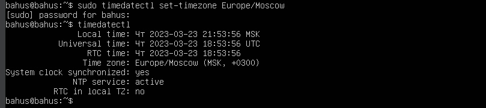
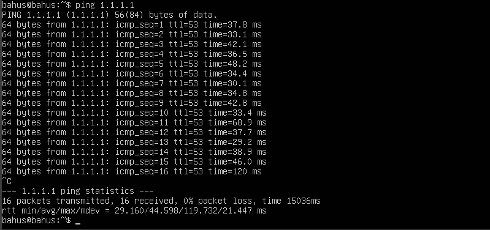
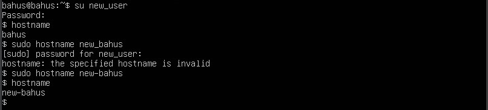
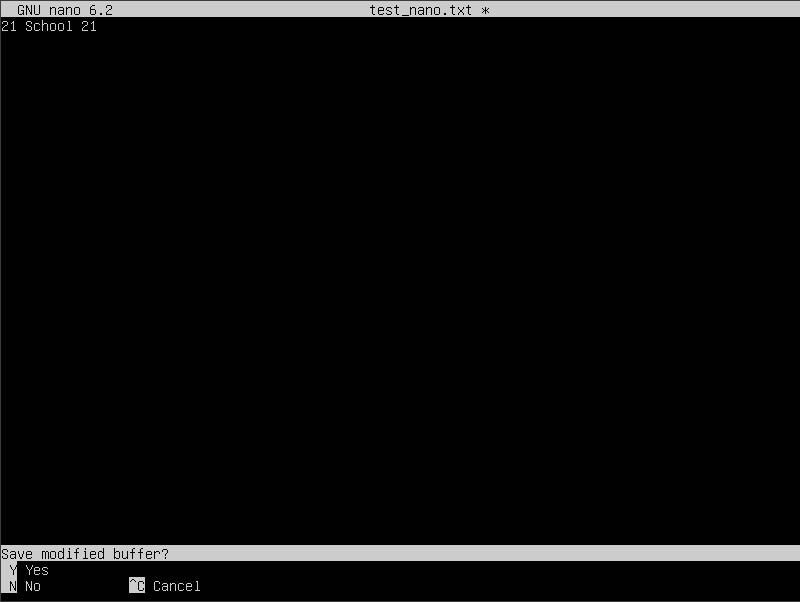

## Part 1. Установка ОС
- ``Смотрим версию Ubuntu после установки `` 
 

## Part 2. Создание пользователя
- ``Создаём пользователя и назначаем ему группу adm(новый пользователь в конце).`` 
 
 

## Part 3. Настройка сети ОС
- ``Задаtv название машины user-1`` 
 
- ``Установливаем временную зону, соответствующую вашему текущему местоположению.`` 
 
- ``Вывовдим названия сетевых интерфейсов``  
<b>lo (loopback device)</b> -- виртуальный интерфейс, присутствующий по умолчанию в любом Linux. Он используется для отладки сетевых программ и запуска серверных приложений на локальной машине. С этим интерфейсом всегда связан адрес 127.0.0.1. У него есть dns-имя – localhost.
 

- ``Узнали внешний IP-адрес`` 
 

- ``Получили ip от dhcp сервера`` 
<b>DHCP</b> -  Dynamic Host Configuration Protocol
 

- ``Внешний ip-адрес шлюза `` 
 

- ``внутренний IP-адрес шлюза, он же ip-адрес по умолчанию (gw)`` 
 

- ``Задали статичные настройки ip, gw, dns, изменив файл /etc/netplan/*.yaml`` 
 

- ``Выполнили команду reboot. Статичные сетевые настройки (ip, gw, dns) соответствуют заданным в предыдущем пункте`` 
 

- ``Пропинговали удаленные хосты 1.1.1.1`` 
 

## Part 4. Обновление ОС
- ``Обновили системные пакеты до последней версии`` 
 
 

## Part 5. Использование команды sudo
-<b>sudo</b> - позволяет временно поднимать привилегии и выполнять задачи администрирования системы с максимальными правами 
``Добавили пользователя в группу с привилегиями sudo, переключились на этого пользователя и поменяли hostname`` 
 
 

## Part 6. Установка и настройка службы времени
- ``Kорректное время и вывод команды`` 
 

## Part 7. Установка и использование текстовых редакторов
- ``Используя каждый из трех выбранных редакторов, создайте файл test_X.txt, где X -- название редактора, в котором создан файл. Напишите в нём свой никнейм, закройте файл с сохранением изменений.`` 
<b>VIM</b>. Для выхода из режима редактирования: esc, для сохранения: :wq  
 

<b>NANO</b>.  Для сохранения: ^O + подтвердить, выход: ^X 
 

<b>JOE</b>. Для сохранения и выхода: ^KX + подтвердить 
 

- ``Используя каждый из трех выбранных редакторов, откройте файл на редактирование, отредактируйте файл, заменив никнейм на строку "21 School 21", закройте файл без сохранения изменений.`` 
<b>VIM</b>. Для выхода без сохранения :q!  
 

<b>NANO</b>.  Для выхода без сохранения: ^X, No 
 

<b>JOE</b>. Для выхода без сохранения: ^C, yes 
 

