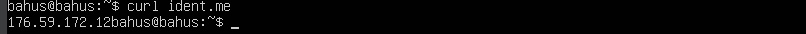
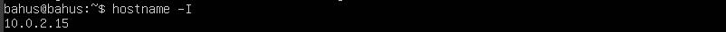

## Part 1. Установка ОС
- ``Смотрим версию Ubuntu после установки `` 
 

## Part 2. Создание пользователя
- ``Создаём пользователя и назначаем ему группу adm(новый пользователь в конце).`` 
 
 

## Part 3. Настройка сети ОС
- ``Задаtv название машины user-1`` 
 
- ``Установливаем временную зону, соответствующую вашему текущему местоположению.`` 
 
- ``Вывовдим названия сетевых интерфейсов``  
<b>lo (loopback device)</b> -- виртуальный интерфейс, присутствующий по умолчанию в любом Linux. Он используется для отладки сетевых программ и запуска серверных приложений на локальной машине. С этим интерфейсом всегда связан адрес 127.0.0.1. У него есть dns-имя – localhost.
 

- ``Узнали внешний IP-адрес`` 
 

- ``Получили ip от dhcp сервера`` 
<b>DHCP</b> -  Dynamic Host Configuration Protocol
 

- ``Внешний ip-адрес шлюза `` 
 

- ``внутренний IP-адрес шлюза, он же ip-адрес по умолчанию (gw)`` 
 

- ``Задали статичные настройки ip, gw, dns, изменив файл /etc/netplan/*.yaml`` 
 

- ``Выполнили команду reboot. Статичные сетевые настройки (ip, gw, dns) соответствуют заданным в предыдущем пункте`` 
 

- ``Пропинговали удаленные хосты 1.1.1.1`` 
 

## Part 4. Обновление ОС
- ``Обновили системные пакеты до последней версии`` 
 
 

## Part 5. Использование команды sudo
- <b>sudo</b> - позволяет временно поднимать привилегии и выполнять задачи администрирования системы с максимальными правами 
``Добавили пользователя в группу с привилегиями sudo, переключились на этого пользователя и поменяли hostname`` 
 
 

## Part 6. Установка и настройка службы времени
- ``Kорректное время и вывод команды`` 
 

## Part 7. Установка и использование текстовых редакторов
- ``Используя каждый из трех выбранных редакторов, создайте файл test_X.txt, где X -- название редактора, в котором создан файл. Напишите в нём свой никнейм, закройте файл с сохранением изменений.`` 
<b>VIM</b>. Для выхода из режима редактирования: esc, для сохранения: :wq  
 

<b>NANO</b>.  Для сохранения: ^O + подтвердить, выход: ^X 
 

<b>JOE</b>. Для сохранения и выхода: ^KX + подтвердить 
 

- ``Используя каждый из трех выбранных редакторов, откройте файл на редактирование, отредактируйте файл, заменив никнейм на строку "21 School 21", закройте файл без сохранения изменений.`` 
<b>VIM</b>. Для выхода без сохранения :q!  
 

<b>NANO</b>.  Для выхода без сохранения: ^X, N 
 

<b>JOE</b>. Для выхода без сохранения: ^C, y 
 

- ``Используя каждый из трех выбранных редакторов, отредактируйте файл ещё раз, а затем освойте функции поиска по содержимому файла (слово) и замены слова на любое другое.`` 

<b>VIM</b>. Для поиска: /"cлово для поиска"  
 
 Для замены: :s/"cлово для замены"/"замена"  
 
 
 
<b>NANO</b>. Для поиска: ^W  
 
 Для замены: ^R  
 

<b>JOE</b>. Для поиска: ^K F  
 
 Для замены: ^K F, затем R, Y  
 

## Part 8. Установка и базовая настройка сервиса SSHD
- ``Установить службу SSHd.`` 
 
- ``Добавили автостарт.`` 
 
- ``Поменяли порт на 2022.`` 
 
- ``Установили net-tools.`` 
 
- ``Используя команду ps, показали наличие процесса sshd.`` 
 
<b>ps</b> - выводит сведения о процессах в статическом виде. 
<b>-e</b> - позволяет выбрать все процессы. 
<b>| grep sshd </b>- поиск по выводу через пайп. 
- ``Вывод команды  <b>netstat -tan</b>.`` 
 
- ``Значение ключей -tan:`` 
<b>-a</b> - Показывать состояние всех сокетов; обычно сокеты, используемые серверными процессами, не показываются. 
<b>-n</b> - Показывать сетевые адреса как числа. netstat обычно показывает адреса как символы. 
<b>-t</b> - Отображать TCP подключения 
<b>Proto</b> - Содержит тип протокола 
<b>Recv-Q</b> - Счётчик байтов не скопированных программой пользователя из этого сокета. 
<b>Send-Q</b> - Счётчик байтов, не подтверждённых удалённым узлом. 
<b>Local Address</b> - Адрес и номер порта локального конца сокета. 
<b>Foreign Address</b> - Адрес и номер порта удалённого конца сокета. 
<b>State </b>- Состояние сокета. 
<b>LISTEN</b> Сокет ожидает входящих подключений. 
<b>SYN_SENT</b> Сокет, находящийся в режиме активной попытки установки подключения. 
<b>0.0.0.0</b> - это немаршрутизируемый адрес IPv4, который используется в качестве адреса по умолчанию или адреса-заполнителя.  

## Part 9. Установка и использование утилит top, htop
-htop
 - отсортированному по PID
   
 - отсортированному по PERCENT_CPU
   
 - отсортированному по PERCENT_MEM
   
 - отсортированному по TIME
   

